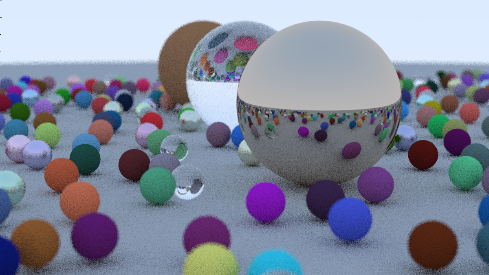

# ParaRay
### A CPU based, multithreaded, ray tracing algorithm capable of rendering a scene with multiple spheres and surface types 

Followed this tutorial: https://raytracing.github.io/books/RayTracingInOneWeekend.html 

Additionally, added support for multithreading. 

## Example image: 
1200 by 675 pixel image rendered in 209s with 16 threads and ~1000s on a single thread: 

## Usage Instructions

1. Clone this repository with `git clone`
2. compile this repsoitory with `g++ -o pararay main.cpp`
3. Run `./pararay -s` to render the scene on a single core or `./pararay -m` to render in multicore mode

## TODO: 
1. Add support for user to specify settings such as output path and resolution in a json file.
2. Allow multicore mode to decide the right amount of threads to start based on its cpu instead of it being hardcoded 
3. Add unit tests 